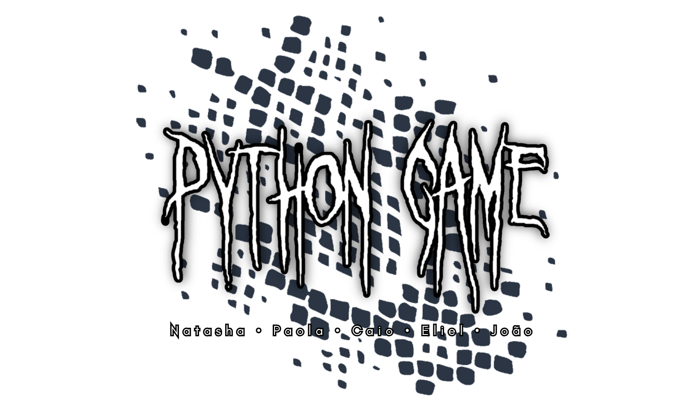

## Descrição:

#### O jogo 'Python Game' se propõe a ser uma dentre várias versões do 'jogo da cobrinha', nessa verssão foi utilizada as bibliotecas FreeSimpleGUI e random, o jogo conta com opções de personalização como mudança de cor da cobrinha e velocidade progressiva.

## Motivo:

#### Python Game foi desenvolvido para ser um projeto em grupo feito em python, do segundo semestre de Licenciatura em Computação - UFRA

## Pré equisitos:

#### Python instalado
#### Biblioteca FreeSimpleGUI instalada

```bash
pip install FreeSimpleGUI
```
## Tutorial:

#### Controles: 

#### Usando os botões A ← , D → , W ↑ , S ↓ , controle a direção para onde vai a cobra e coma as 'comidas' vermelhas.

#### Configurações:

#### Use-a para escolha a cor da cobra e se quer ou não a velocidade da mesma aumentando a cada comida